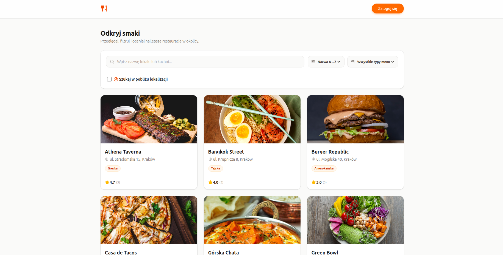

# **Gdzie zjeść?**<br>Portal ocen restauracji

Internetowy portal z ocenami restauracji. Bez logowania można przeglądać restauracje wraz z ocenami, filtrować je i wyszukiwać. Po zalogowaniu użytkownik może dodawać własne restauracje wraz z mapą i zdjęciem lokalu, wystawiać opinie, oznaczać ulubione oraz wyszukiwać pełnotekstowo w komentarzach.

## Zrzut ekranu



## Tech stack

### Backend

| Technologia | Zastosowanie |
|---|---|
| **Node.js** + **Express** (TypeScript) | Serwer API w architekturze MVC |
| **Prisma 7** | ORM i migracje bazy danych |
| **PostgreSQL** | Baza danych |
| **argon2** | Hashowanie haseł |
| **JWT** | Sesja w ciasteczku httpOnly |
| **Zod** | Walidacja danych wejściowych |
| **Multer** | Upload zdjęć restauracji |

### Frontend

| Technologia | Zastosowanie |
|---|---|
| **React** + **TypeScript** + **Vite** + **Tailwind CSS**| Aplikacja kliencka |
| **React Router** | Routing po stronie klienta |
| **TanStack Query** | Pobieranie danych i cache |
| **React Hook Form** + **Zod** | Obsługa i walidacja formularzy |
| **Leaflet** + **react-leaflet** | Interaktywne mapy |
| **Nominatim** (OpenStreetMap) | Geokodowanie adresów na współrzędne |
| **lucide-react** | Ikony |
| **sonner** | Powiadomienia |

### Infrastruktura

| Technologia | Zastosowanie |
|---|---|
| **Docker** + **Docker Compose** | Konteneryzacja całej aplikacji |
| **run.sh** | Skrypt uruchamiający projekt jedną komendą |

## Funkcje

- Przeglądanie restauracji ze średnią ocen
- Filtrowanie po nazwie, rodzaju menu i odległości - wyszukiwanie po adresie - z łączeniem filtrów
- Sortowanie po nazwie, ocenie i liczbie opinii
- Szczegóły restauracji z mapą lokalizacji i listą opinii
- Rejestracja, logowanie i reset hasła
- Dodawanie restauracji z wyborem lokalizacji na mapie i uploadem zdjęcia
- Wystawianie jednej opinii na restaurację wraz z opcjonalnym komentarzem oraz jej usuwanie
- Usuwanie własnych restauracji
- Ulubione restauracje
- Pełnotekstowe wyszukiwanie w komentarzach z podświetlaniem trafień

## Uruchomienie

Aplikacja jest w pełni skonteneryzowana. Jedna komenda stawia bazę danych z przykładowymi danymi, backend oraz zbudowany frontend.

### Wymagania

- Zainstalowany i uruchomiony **Docker**

### Kroki

1. Zainstaluj **Docker** i upewnij się, że jest uruchomiony.

2. Sklonuj repozytorium i wejdź do jego katalogu:
   ```bash
   git clone <adres-repozytorium>
   cd restaurant-review-portal
   ```

3. Uruchom skrypt startowy:
   ```bash
   ./run.sh
   ```

4. Po zbudowaniu aplikacja jest dostępna pod adresem:
   ```
   http://localhost:3000
   ```

### Reset do stanu początkowego

Usuwa bazę i wgrane zdjęcia, a kolejne uruchomienie odtworzy dane przykładowe:

```bash
docker compose down -v
./run.sh
```